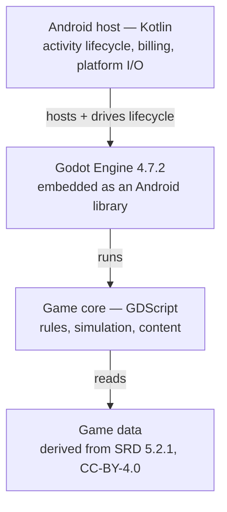

# DungeonLike

A roguelike dungeon crawler for Android, built on rules and reference data derived
from the **System Reference Document 5.2.1** (CC-BY-4.0).

> **Status: pre-alpha.** The repository contains the project foundation, the
> Gradle build, a thin Kotlin host and the embedded Godot engine. There is no
> gameplay yet. See the [roadmap](#roadmap).

---

## Product

| Aspect | Value |
| ------ | ----- |
| Application ID | `com.yuumi.dungeonlike` |
| Distribution | Google Play, premium (one-time purchase) |
| Devices | 64-bit smartphones and tablets |
| Minimum Android | 14 (API 34) |
| Compile / target | API 37.2 (SDK extension 24) |
| ABI | `arm64-v8a` only |
| Languages | English (default), Italian, Spanish, French, German |
| Code | Kotlin (Android host), GDScript (game core) |
| Input | Touch, plus full mouse and keyboard support when detected |

## Architecture

The application is a **thin Kotlin host around an embedded Godot engine**.



- **Godot owns all rendering**, including menus and adaptive phone/tablet layout,
  which is expressed with Godot's own anchor and container system.
- **Kotlin stays thin**: activity lifecycle, in-app purchase, and platform I/O.
- **GDScript holds gameplay logic**: rules, simulation, and content.

This split is not stylistic. Godot's Android library documentation states that
only one engine instance is supported per process, and that resize/orientation
configuration events are unsupported and may crash. Driving the UI from a native
Kotlin layer above a resizing Godot surface would sit directly on top of that
constraint. The rationale, alternatives, and consequences are recorded in
[ADR 0002](docs/architecture/adr/0002-engine-and-ui-architecture.md).

## Repository layout

```text
app/                             Android application module (thin Kotlin host)
  src/main/kotlin/               Activity, input detection, host↔engine bridge
  src/main/res/                  Resources, complete in all five locales
  proguard-rules.pro             R8 keep rules for the engine's JNI surface
game/                            Godot project (GDScript game core)
  project.godot                  Engine project settings
  export_presets.cfg             Pack export preset used by CI
config/
  android/toolchain.properties   Android SDK / NDK / ABI / Java — source of truth
  build-tool-security.versions   Security pins for build tooling
docs/
  architecture/THREAT_MODEL.md   Assets, trust boundaries, accepted risks
  architecture/adr/              Architecture Decision Records
  release/READINESS.md           Release gates
gradle/libs.versions.toml        Gradle version catalogue
gradle/verification-metadata.xml Dependency checksums and signatures
scripts/                         Repository validation scripts used by CI
VERSION                          Application version — source of truth
```

Nested `AGENTS.md` files in `.github/`, `scripts/`, `app/` and `game/` carry the
instructions specific to each area; the root file carries what applies
everywhere.

## Sources of truth

Each value below has exactly one authoritative home. CI fails if a consumer
restates it.

| Concern | Owned by |
| ------- | -------- |
| Application version | [`VERSION`](VERSION) |
| SDK, build tools, NDK, CMake, ABI, Java | [`config/android/toolchain.properties`](config/android/toolchain.properties) |
| Gradle libraries and plugins | [`gradle/libs.versions.toml`](gradle/libs.versions.toml) |
| Build-tooling security pins | [`config/build-tool-security.versions`](config/build-tool-security.versions) |
| Labels used by automation | [`.github/labels.yml`](.github/labels.yml) |

`VERSION` holds a bare SemVer string (`0.1.0`). The `v` prefix is a git tag
convention only (`v0.1.0`), so no consumer has to strip it.

## Toolchain

Every version below was verified against a primary source rather than assumed.

| Component | Version | Evidence |
| --------- | ------- | -------- |
| Android SDK Platform | 37.2 (ext. 24) | stable channel of Google's SDK repository index |
| Build Tools | 37.0.0 | stable channel |
| NDK | 29.0.14206865 | matches Godot 4.7.2's Android library |
| CMake | 4.1.2 | stable channel |
| Android Gradle plugin | 9.4.0 | supports a maximum of API 37 |
| Gradle | 9.7.1 | current release |
| Kotlin | 2.4.20 | current release |
| JDK | 17 | AGP 9.4.0 ships Java 17 bytecode; Godot declares Java 17 |
| Godot | 4.7.2-stable (standard build) | published to MavenCentral as `org.godotengine:godot`, signed |

## Verification

**All executable verification runs in GitHub Actions.** Gradle tasks, builds,
tests, Android tooling, emulators, and packaging are not run locally. A change is
not considered verified until the relevant workflow jobs pass.

| Workflow | Purpose |
| -------- | ------- |
| `ci.yml` | Linting, GDScript lint/format, repository invariants, commit conventions |
| `android.yml` | Game pack export, Gradle build, unit tests, Android lint |
| `codeql.yml` | Static security analysis (`actions`, `java-kotlin`) |
| `label.yml` / `labels-sync.yml` | Pull request labelling and label reconciliation |
| `stale.yml` | Inactivity triage |
| `dependabot-auto-merge.yml` | Auto-merge of low-risk dependency updates |

Two build inputs are *generated by Gradle* and therefore cannot be produced
locally under this policy: the Gradle wrapper and
`gradle/verification-metadata.xml`. The `bootstrap` job in `android.yml` produces
them as an artifact to be committed, and is also how verification metadata is
refreshed after a dependency update. See
[ADR 0005](docs/architecture/adr/0005-build-structure-and-supply-chain-verification.md).

## Contributing

See [`CONTRIBUTING.md`](CONTRIBUTING.md). Commits follow
[Conventional Commits 1.0.0](https://www.conventionalcommits.org/en/v1.0.0/); run
`git config commit.template .gitmessage` once to load the template.

Report security issues privately — see [`SECURITY.md`](SECURITY.md).

## Roadmap

1. ✅ Repository foundation — governance, legal, CI/CD, sources of truth
2. ✅ Gradle project and Kotlin host skeleton
3. ✅ Godot 4.7.2 engine integration (standard build, GDScript), with dependency
   verification and a CI-exported game pack
4. ⬜ SRD content pipeline producing structured, localized game data
5. ⬜ Gameplay systems, UI/UX, mouse and keyboard support
6. ⬜ Play Store release, signing, and store metadata

## Licence

DungeonLike is **proprietary**; see [`LICENSE.md`](LICENSE.md). Public visibility
does not grant a licence to use, copy, modify, or redistribute it.

Third-party and CC-BY-4.0 material is inventoried in
[`THIRD_PARTY_NOTICES.md`](THIRD_PARTY_NOTICES.md), which carries the System
Reference Document 5.2.1 attribution required in each supported locale.
